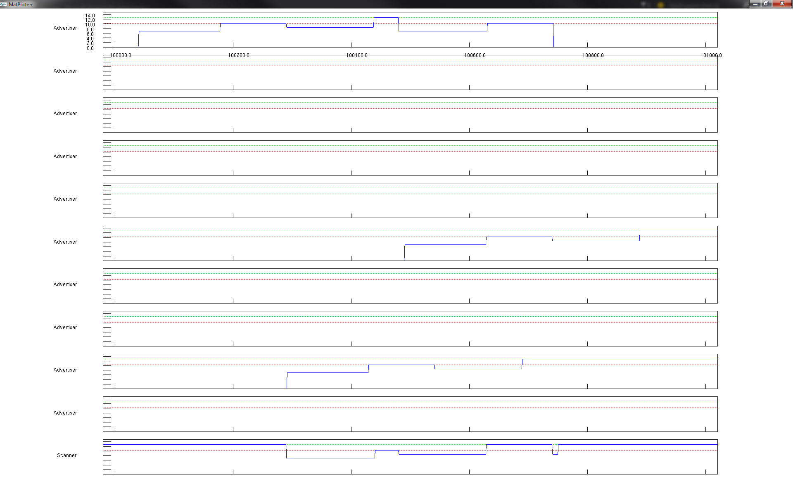

# wsn_sim
## Senior Design 2015
Based on work by Trond Einar Snekvik
Discrete simulator for Wireless Sensor Network applications.

Based on the Nordic Semiconductor nRF51 radio, this framework simulates real conditions in wireless sensor networks, and features packet collisions, accurate transmit times, random packet drops, realistic power consumption models and graphical representation of power consumption in devices, clock drift, real BLE packets.

The simulator displays power consumption graphs in OpenGL by the use of [Matplot++](https://code.google.com/p/matplotpp/), an open source C++ graphing library based on the Matlab plotting functionality. The Matplot++ framework is included in the repo, with GLUT headers and libraries for Windows. 

The framework can also deploy [GraphViz](http://www.graphviz.org) files for graphical topology representation, but GraphViz itself must be downloaded from their website (it's free).

## Why was this made?
The project is part of Trond Einar Snekvik's Master Thesis at NTNU. All existing simulator solutions I could find were either aimed at less power constrained systems, had too much fluff and bloat or didn't include proper power analyzation, so I made my own.

## What has been done?
The framework has additional Bluetooth Low Energy packets and a BLE advertiser/scanner example included. In addition, a novel Meshing solution is partly implemented.

## Getting started
### Prerequisites 
- Visual Studio 2013 or 2015 (Community, Express and Professional have all been tested and should work :thumbsup:)
- Git

### How to build and run
1. Clone the repository to a local folder on your machine (do not use the zipped version)
2. Enter your new local copy, and run `git submodule init` to fetch the latest version of [RandomLib](http://randomlib.sourceforge.net/).
3. Enter _\<wsn_sim-folder>/randomlib/windows/_, and open _Random-vc9.vcproj_ in your favorite flavor of Visual Studio.
4. In VS, accept any requests to do a one-way upgrade of the randomlib, and build the project in x86 mode, both in release and debug-configurations. Check out [RandomLib's project page](http://sourceforge.net/projects/randomlib/) if you run into any issues with this step.
5. Open _wsn_sim.sln_ in the root folder in your local copy of wsn-sim. Make sure you it opens in the same version of VS as the RandomLib.
6. Right click the target "BLE_adv_scan_test" in the solutions overview, and press "Set as StartUp Project". Compile the solution in Win32 mode, Release-config (or Debug, but performance will be significantly worse). You should now be able to run your first simulation of a BLE advertiser/scanner.

**Note:** If you want to draw your network topology, you have to install graphviz (see above), and add its _/bin/_ folder to your PATH. If you try and call `WSN::exportGraphviz()` without this, you will get a runtime error. Also note that Visual Studio must be restarted if you change you environmental variables. You may also have to open a new instance of Windows Explorer. If your computer still has issues finding graphviz after this, restart it.

### Using the powerplot-GUI
The power graph displayed at the end of the example project runs shows the power consumption in each device in the simulation. By default, the simulation only cares for radio-module power consumption, but you may add your own power consumption in addition by using the `Device::registerPowerDrain()` and `Device::removePowerDrain()` functions.

Navigation in the GUI:

| Action        | Keyboard shortcut |
|---------------|-------------------|
| Slow navigation       | Arrow keys (left/right) | 
| Fast navigation       | Shift+Arrow keys |
| Jump one window length left | Page down | 
| Jump one window length right | Page up | 
| Jump ten window lengths left | Ctrl+Page down | 
| Jump ten window lengths right | Ctrl+Page up |
| Jump one base length right | Ctrl-Arrow key right | 
| Jump one base length left | Ctrl-Arrow key left | 
| Zoom in/out | Arrow key up/down |
| Go to beginning | Home |
| Go to end | End | 

The base length is the delta between the `startTime` and `endTime` parameters given to `PowerPlotter::displayGraph()`.

### Troubleshooting
Whenever you run into any issues, make sure your local copy is up to date with this repository.

**Where are my topology renders?** The topology renders are generated as .png files, and are saved to the location of your  executable. `WSN::exportGraphViz()` must be called before `PowerPlotter::displayGraph()` (displaying the power-graphs), as the power plotter is a blocking function.

**Everything builds fine, but VS doesn't generate an .exe for my project!** Make sure that the target is staged for compilation. Right click the solution in the Solution Explorer in VS and select Properties. Then go to Configuration Properties->Configuration, nad see whether your preferred target is setup for building for the current configuration and platform.

**I get "fatal error LNK1112: module machine type 'X86' conflicts with target machine type 'x64'" when I compile** Currently, only x86 is supported, as I haven't found a working x64 version of the glut-library which integrated properly. 

Feel free to submit an issue if you have any other problems, and I'll try to help you out.

## Further exploration
You may try the MeshTesting target, and see the experimental meshing solution in action, or you may want to start your own project. The easiest way to go about it is to make a copy of the _BLE_adv_scan_test_ folder, rename it and its project files, and add it to the root-folder VS-solution. If you want a cleaner option, take a look at how the adv-scan-example references the WSN-sim base-project (and BLE_common, if you want to experiment with BLE-packets), through the target property menus in VS. The base project builds to a static library, and requires the MatplotPP-lib and the glut32-lib in the _/MatplotPP/_ folder.

